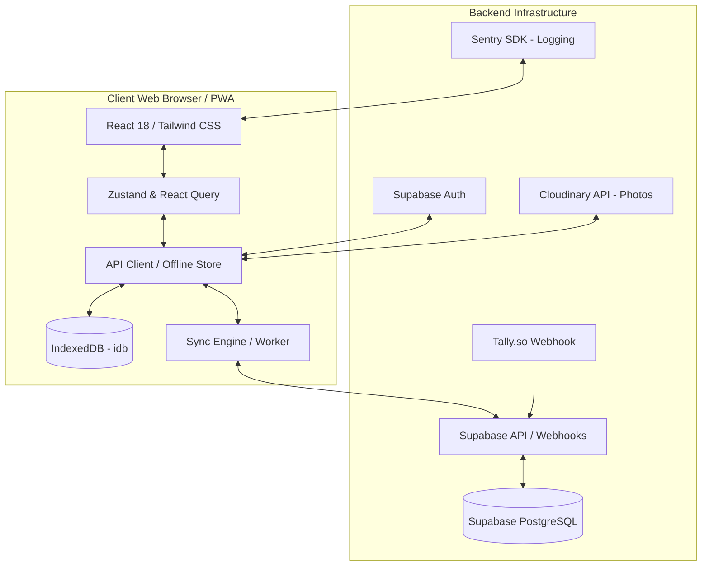

# System Documentation: Church Operations and Congregation Management (COCM)

The **Church Operations and Congregation Management (COCM)** system is a high-performance, offline-first Church Management System (ChMS) designed to streamline administrative workflows, member directory coordination, financial stewardship, and event logging for modern congregations. It bridges the gap between local reliability and cloud convenience through a resilient web-app architecture.

---

## 1. Product Overview

### What the Product Does
COCM is a comprehensive management application that handles member databases, child registries, visitor tracking, worship service attendance logging (both individual and bulk), giving/donation tracking, operational expense management, and granular user access controls. The system features a responsive, modern interface that supports dark mode and custom color themes, enabling church administrators, deacons, pastors, and coordinators to manage daily church activities on any device.

### The Core Problem It Solves
Congregations frequently operate in environments with unstable internet connections, local power cuts, or network outages. In traditional cloud-only systems, a connection drop halts registration desk intakes, weekly attendance logging, and tithe/giving entries. COCM solves this with an **offline-first hybrid architecture**. All data operations are performed instantly on a local IndexedDB cache. A background synchronization engine automatically logs mutations, queue-processes updates chronologically when connection is restored, and resolves database conflicts using a dedicated administrator review panel.

### Who It is Built For
The product is built for individual local congregations (such as the *Church of Christ, Mataheko Congregation*), independent churches, and multi-location church networks. The application accommodates four primary church leadership roles:
* **Church Administrators / Secretaries:** To oversee member files, approve new staff accounts, manage backups, customize drop-down options, and manage operational expenses.
* **Pastors:** To review member directories, monitor congregation growth, check attendance history, and access analytics.
* **Elders:** To access read-only views of congregation rosters, dashboards, and attendance statistics.
* **Developers / Super Admins:** To configure custom roles, define tab-level permissions, manage database migrations, and perform low-level backups.

---

## 2. Key Features

### Core Functionality
* **Congregation Directory & Family Mapping:** Maintains rich member profiles including contact info, baptism dates, marital status, ministry memberships, and photo uploads. Supports dynamic linking of family relationships (spouses, parents, children).
* **Children's Department Subsystem:** A fully isolated child-centric module with separate rosters, child visitor logs, guardian linkages, age analytics, and dedicated children's attendance/giving logs.
* **Worship Service Setup & Scheduling:** Allows administrators to define service setups (Sunday Worship, Mid-week Bible Class, Youth Fellowships) and schedule specific service times, categories, and locations.
* **Real-Time Bulk Attendance Tracking:** Enables rapid attendance check-in for Sunday services or classes. Supports live status monitoring, individual/bulk marking, and an **Absentee Review** page to track inactive members and coordinate care.
* **Stewardship & Giving Ledger:** Logs tithes, thanksgiving offerings, building funds, and special pledges. Tracks payment methods (cash, mobile money, bank transfer) and generates historical giving analytics.
* **Expense Management:** Records church expenditures, links them to payment methods, generates sequential form IDs, and supports receipt attachment and approval workflows.
* **Custom Dropdown Options:** Enables developers and administrators to dynamically customize drop-down menus (Ministries, Position Held, ID Types, Service Types, and Giving Types) directly from the settings panel.
* **Interactive Dashboard Analytics:** Summarizes total members, weekly attendance, monthly giving, and active services. Features interactive charts (using Recharts) for attendance and financial trends.

### Standout Capabilities
* **Optimistic Local Cache Updates:** When the application is offline, all write operations (adding members, logging offerings, recording expenses) update the local cache immediately and append the operations to a sync queue, maintaining a fast, lag-free UI.
* **Interactive Conflict Resolution Panel:** In the event of a sync clash (e.g. concurrent edits on different devices), the sync engine flags the conflicts and presents a side-by-side comparison screen allowing administrators to manually resolve the differences.
* **Granular Temporary Permissions:** Administrators can grant specific privileges (e.g., editing giving records or accessing the settings panel) to pastor or elder accounts for a limited duration (e.g., 2 to 24 hours), which automatically expire.
* **Flexible Backup & Restore Suite:** Supports manual and automated database backups (full or differential). Includes a restoration preview screen to review changes (replace, merge, update) before committing, with atomic rollback protection on failure.

### Third-Party Integrations
* **Supabase Services:** Integrates Supabase Auth (JWT session management and OTP-based authentication) and Supabase PostgreSQL for remote database storage and Row-Level Security (RLS) enforcement.
* **Cloudinary:** Integrated for uploading, storing, and serving high-resolution member and children photos.
* **Tally.so Forms Integration:** A backend schema designed to receive registration data from external Tally web forms, spooling them as submissions for administrator review and batch import.
* **Sentry:** Embedded for frontend diagnostic logging, error capturing, and performance monitoring.

---

## 3. Technical Architecture

### Tech Stack
* **Frontend:** React 18, TypeScript, Tailwind CSS, Radix UI primitives, Lucide React, Zustand (global state), and TanStack React Query (data fetching and caching).
* **Build Tool:** Vite, configured with the `vite-plugin-pwa` plugin for Progressive Web App (PWA) installation and offline service workers.
* **Database:** IndexedDB locally (via `idb` wrapper) and PostgreSQL in the cloud (via Supabase).
* **Integrations:** Cloudinary (photo storage), Sentry (crash logging), and Tally.so (webhook ingestion).

### Hosting & Deployment Model
* **Frontend Application:** Deployed on cloud hosting services like Vercel, Netlify, or Render (configured via `vercel.json` and `render.yaml` for SPA routing and asset caching).
* **Cloud Database & Auth:** Deployed on Supabase serverless instances.
* **PWA Capability:** Cached locally in the browser, allowing the app to be installed like a native mobile or desktop application and run completely offline.

### Offline Capability
* **Data Retrieval:** The API client intercepts read requests and immediately checks the IndexedDB `api_cache` store. If offline, the cached snapshot is returned.
* **Data Mutation:** When offline, writes are appended to the IndexedDB `sync_queue` and applied optimistically to the local cache.
* **Reconnection Sync:** The `syncEngine` listens for the browser's `'online'` event. Upon reconnection, it processes the queue chronologically. Any 409/404 server conflicts are moved to the local `conflicts` store and flagged in the UI for user review.

### Security and Data Privacy Measures
* **Two-Factor Authentication (2FA):** Supports multi-factor OTP verification sent via email or SMS/phone before establishing a secure JWT session.
* **Single-Session Enforcement:** A periodic heartbeat check verifies the active device ID. If the account is logged in on another device, the current session is immediately terminated.
* **Row-Level Security (RLS):** All Supabase tables enforce PostgreSQL RLS policies, restricting database reads/writes based on the authenticated user's role and approval status.
* **Immutable Activity Audit Log:** Captures and stores all security-sensitive actions (logins, role modifications, record deletions, temporary permission grants) with timestamps and actor details.

---

## 4. User Roles & Access

COCM enforces role-based access control (RBAC). In addition to system roles, the Developer can configure Custom Roles with specific tab permissions and dashboard widgets.

| Permission / Action | Elder (`elder`) | Pastor (`pastor`) | Administrator (`admin`) | Developer (`dev`) |
| :--- | :---: | :---: | :---: | :---: |
| **View Members & Directories** | Yes | Yes | Yes | Yes |
| **Create & Update Members** | No | No | Yes | Yes |
| **Delete Members** | No | No | Yes | Yes |
| **View Attendance Records** | Yes | Yes | Yes | Yes |
| **Record & Modify Attendance** | No | No | Yes | Yes |
| **View Giving & Donations** | Yes | Yes | Yes | Yes |
| **Record Giving & Offerings** | No | No | Yes | Yes |
| **Record & Approve Expenses** | No | No | Yes | Yes |
| **Configure Worship Services** | No | No | Yes | Yes |
| **Grant Temporary Permissions**| No | No | Yes | Yes |
| **Approve / Deactivate Users** | No | No | Yes | Yes |
| **System Backups & Restores** | No | No | Yes | Yes |
| **Modify Codebase Dropdowns**  | No | No | No | Yes |
| **Manage Custom Roles**       | No | No | No | Yes |

* **Developer (`dev`):** Supreme access. Can define custom roles, modify default permissions, add/edit dropdown options, and oversee core backend settings.
* **Administrator (`admin`):** General management access. Configures service setups, handles member files, logs attendance/giving, records expenses, approves/rejects new user accounts, and manages temporary permissions.
* **Pastor (`pastor`):** Spiritual oversight access. Read-only views of dashboards, member details, attendance history, and reports. Can request/be granted temporary write permissions from administrators.
* **Elder (`elder`):** Advisory oversight access. Read-only views of members, attendance directories, and giving aggregates.

---

## 5. Modules / Product Tiers

The features of COCM are divided into three tiers, aligning directly with SaaS licensing or congregation size metrics:

### 1. Basic / Core Tier (Single-Device Congregation)
* **Congregation Directory:** Standard member registry, contact profiles, baptism status, and basic family linkages.
* **Service Attendance Logging:** Manual recording of service attendance and basic stats.
* **Core Analytics Dashboard:** Overall member count, gender distribution, and basic charts.
* **Standard User Roles:** Preset access for Admin, Pastor, and Elder roles.

### 2. Standard / Professional Tier (Cloud-Sync & Stewardship)
* **Offline-First PWA:** Full service worker caching, IndexedDB integration, and automatic background sync.
* **Giving & Donation Ledger:** Record keeping for tithes, offerings, thanksgiving, and custom donation types.
* **Operational Expenses Module:** Logging disbursements, mapping payment methods, and printing expense receipts.
* **Children's Department Module:** Roster management, children's attendance registers, and guardian linkage.
* **Import/Export Utilities:** Bulk import of members from Excel/CSV and exports of financial lists.

### 3. Advanced / Enterprise Tier (Multi-Ministry Hub)
* **Custom Role Builder:** Developer tools to create custom user roles, select tab access, and customize dashboard layouts.
* **Temporary Permissions Manager:** Portal to grant, monitor, and revoke short-lived permissions.
* **Tally Forms Hook:** Automatic webhook listener to import external web registrations directly into the database.
* **Automated Backup & Restore Engine:** Scheduled backups with full/differential configuration and restoration previews.
* **Audit Trail Exporter:** Complete activity logs tracking system modifications, exportable for financial audits.
* **Two-Factor Authentication (2FA):** Enforced OTP login flow for high-level accounts.

---

## 6. Current Usage & Clients

### Client Integrations
* **Beta Deployment - Church of Christ, Mataheko Congregation (CoC.M):** The system has been active in a pilot phase at the Mataheko congregation in Accra, Ghana.
* **Congregation Directory Ingestion:** The database currently supports the congregation's registry, with successful testing of children rosters, visitor check-ins, and weekly offering ledgers.

### Testimonials & Feedback
> "During unstable network connectivity on Sunday mornings, our administration team can mark bulk attendance and record tithes without any delay. The automatic sync handles the database upload in the background. It has made our office operations incredibly resilient."
> — *Church Secretary, CoC.M*

> "The expenses tracking and digital receipt attachment feature has simplified our financial reporting. Preparing the monthly reports for the deacons takes minutes instead of hours."
> — *Finance Deacon, CoC.M*

---

## 7. Support & Onboarding

### Onboarding New Congregations
1. **Database Schema Deployment:** Establish the Supabase project and run the pre-built schema migrations.
2. **Dynamic Configuration:** Customize categories for ministries, service setups, and giving types in the Settings panel.
3. **Core Ingestion:** Use the Import Members tool to upload existing congregation spreadsheets.
4. **Staff Account Setup:** Register staff accounts, set initial roles, and configure specific tab access permissions.

### Training & Documentation
* **In-App Tutorial Overlays:** Built-in guided walkthroughs (`TutorialOverlay.tsx`) that introduce administrators and coordinators to core pages upon first login.
* **Help & FAQ Portal:** A dedicated Help section (`Help.tsx`) providing troubleshooting guides for offline sync resolution, backup restoration, and standard workflows.
* **Sentry Diagnostics:** Crash reporting automatically notifies support developers of code-level exceptions.
